# Project 1 – Boolean Logic

> **Navigation**

- **Home:** [System-Hardware](../README.md)
- **Next Project:** [Project 2 – Boolean Arithmetic](../Project2-Boolean_Arithmetic/README.md)

---

# Overview

Project 1 introduces the fundamental concepts of **Boolean Logic** using the Hardware Description Language (HDL).

The objective is to construct elementary logic gates using only the **NAND** gate and understand how these gates become the building blocks of larger digital systems.

By the end of this project, you will have implemented the core combinational logic circuits that will be reused throughout the remaining NAND2Tetris projects.

---

# Learning Objectives

After completing this project, you should be able to:

- Understand Boolean Algebra
- Write HDL programs
- Build combinational circuits
- Understand hierarchical chip design
- Work with single-bit and multi-bit buses
- Understand multiplexing and demultiplexing

---

# Project Structure

```
Project1-Boolean_Logic
│
├── README.md
│
├── assets
│   ├── not
│   ├── and
│   ├── or
│   ├── xor
│   ├── mux
│   ├── dmux
│   ├── not16
│   ├── mux4way16
│   └── or8way
│
├── And.hdl
├── DMux.hdl
├── Mux.hdl
├── Not.hdl
├── Not16.hdl
├── Or.hdl
├── Or8Way.hdl
├── Xor.hdl
└── Mux4Way16.hdl
```

---

# Chips Implemented

| Chip | Description |
|------|-------------|
| Not | Logical Inverter |
| And | Logical AND Gate |
| Or | Logical OR Gate |
| Xor | Exclusive OR Gate |
| Mux | 2-way Multiplexer |
| DMux | 2-way Demultiplexer |
| Not16 | 16-bit Inverter |
| Mux4Way16 | 4-way 16-bit Multiplexer |
| Or8Way | OR across eight inputs |

---

# Chip Documentation

---

# NOT Gate

## Theory

The NOT gate is the simplest logic gate.

It produces the complement of its input.

Boolean Expression

```
OUT = ¬A
```

---

## Truth Table

<p align="center">

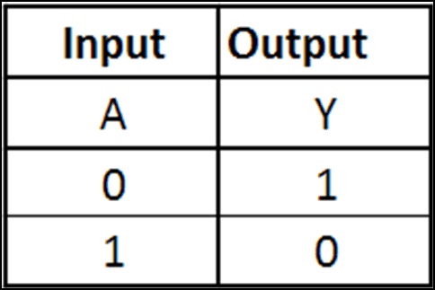

</p>

---

## Circuit Diagram

<p align="center">

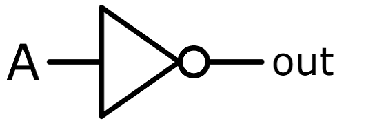

</p>

---

## HDL Design

The implementation ties both inputs of the NAND gate together.

This causes the NAND gate to behave exactly like a NOT gate.

---

# AND Gate

## Theory

The AND gate outputs HIGH only when both inputs are HIGH.

Boolean Expression

```
OUT = A • B
```

---

## Truth Table

<p align="center">

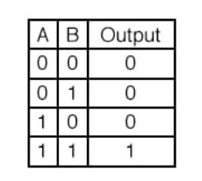

</p>

---

## Circuit Diagram

<p align="center">

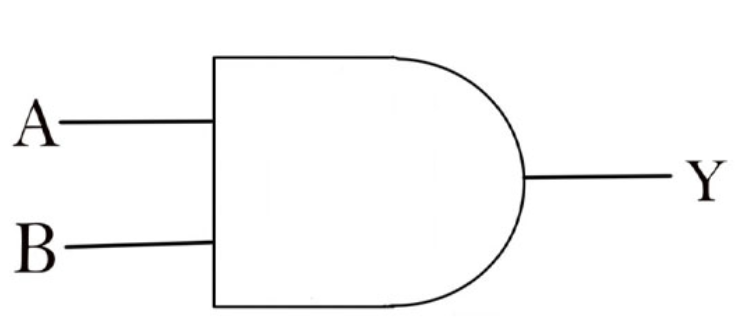

</p>

---

## HDL Design

The AND gate is built using NAND followed by a NOT gate.

This demonstrates how NAND can reproduce the functionality of an AND gate.

---

# OR Gate

## Theory

The OR gate outputs HIGH whenever at least one input is HIGH.

Boolean Expression

```
OUT = A + B
```

---

## Truth Table

<p align="center">

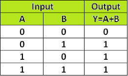

</p>

---

## Circuit Diagram

<p align="center">

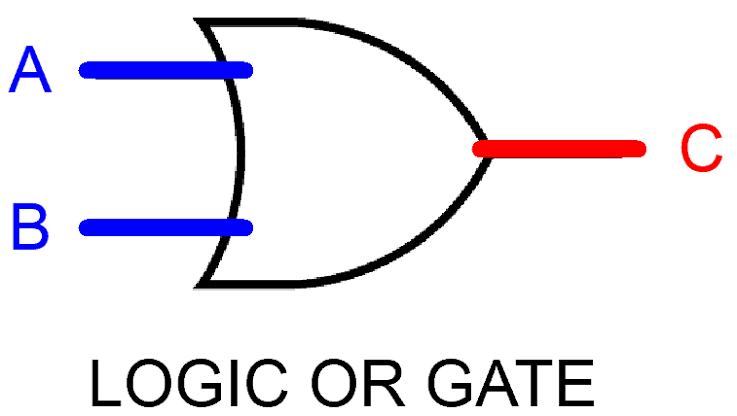

</p>

---

## HDL Design

Implemented using De Morgan's Law.

---

# XOR Gate

## Theory

The XOR gate outputs HIGH only when the two inputs are different.

This gate becomes essential in arithmetic circuits.

Boolean Expression

```
OUT = A ⊕ B
```

---

## Truth Table

<p align="center">

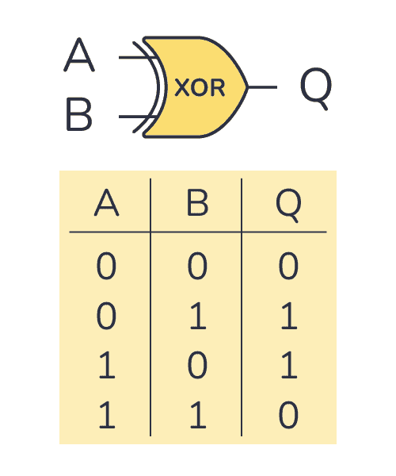

</p>

---

## Circuit Diagram

<p align="center">

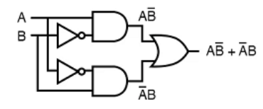

</p>

---

## HDL Design

Constructed using previously implemented gates.

---

# MUX

## Theory

A Multiplexer selects one of two inputs depending on the selector bit.

```
sel = 0 → A

sel = 1 → B
```

---

## Truth Table

<p align="center">

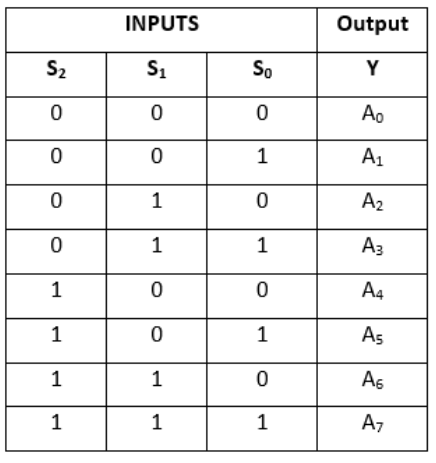

</p>

---

## Circuit Diagram

<p align="center">

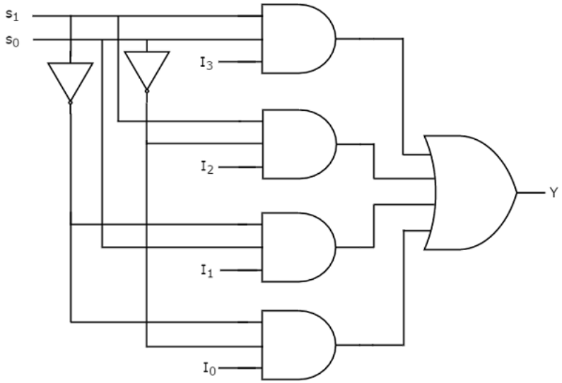

</p>

---

## HDL Design

Uses NOT, AND and OR gates to route the selected input to the output.

---

# DMUX

## Theory

A Demultiplexer routes one input to one of two outputs depending on the selector.

---

## Truth Table

<p align="center">

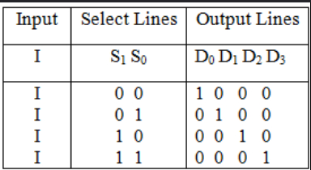

</p>

---

## Circuit Diagram

<p align="center">

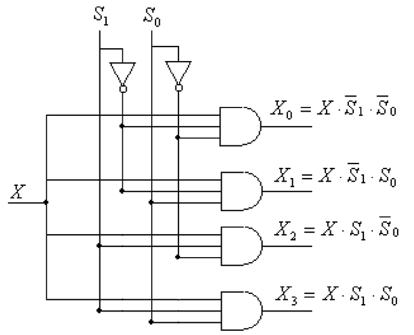

</p>

---

## HDL Design

Uses NOT and AND gates to direct the input signal toward the selected output.

---

# NOT16

## Theory

Performs the NOT operation independently on each bit of a 16-bit input bus.

---

## Circuit Diagram

<p align="center">

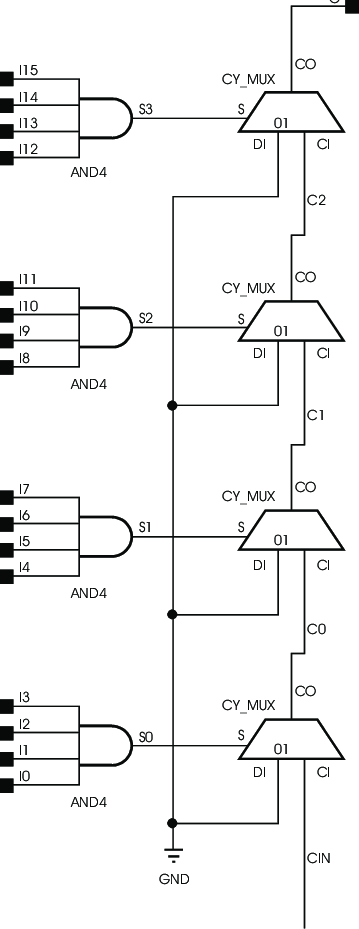

</p>

---

## HDL Design

Implemented using sixteen NOT gates operating in parallel.

---

# MUX4Way16

## Theory

Selects one of four 16-bit input buses.

Two selector bits determine which input reaches the output.

---

## Circuit Diagram

<p align="center">

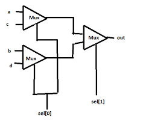

</p>

---

## HDL Design

Built hierarchically using multiple MUX components.

---

# OR8Way

## Theory

Computes the OR of eight input signals.

If any input is HIGH, the output becomes HIGH.

---

## Circuit Diagram

<p align="center">

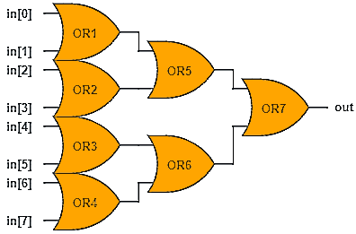

</p>

---

## HDL Design

Implemented using a tree of OR gates.

---

# Common Mistakes

- Confusing XOR with OR.
- Mixing Multiplexer and Demultiplexer.
- Incorrect selector bit ordering.
- Forgetting that buses operate bit-by-bit.
- Building complex chips directly instead of reusing simpler chips.

---

# References

- *The Elements of Computing Systems* — Noam Nisan & Shimon Schocken
- NAND2Tetris Project 1 Documentation

---

# Navigation

**Home:** [System-Hardware](../README.md)

**Next:** [Project 2 – Boolean Arithmetic](../Project2-Boolean_Arithmetic/README.md)