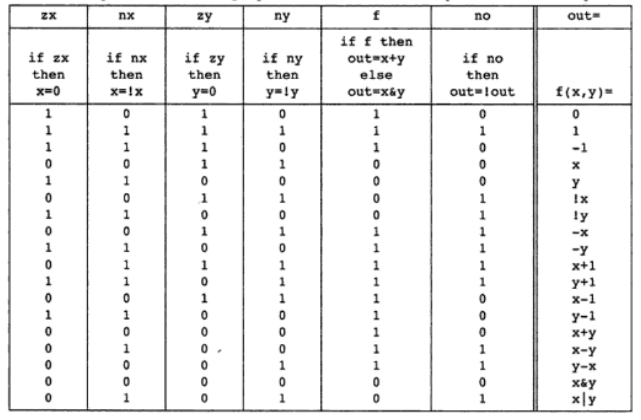

# Project 2 – Boolean Arithmetic

> **Navigation**

- **Home:** [System-Hardware](../README.md)
- **Previous Project:** [Project 1 – Boolean Logic](../Project1-Boolean_Logic/README.md)
- **Next Project:** [Project 3 – Sequential Logic](../Project3-Sequential_Logic/README.md)

---

# Overview

Project 2 introduces arithmetic circuit design using the logic gates developed in **Project 1**.

The objective is to design circuits capable of performing binary arithmetic operations. Beginning with simple one-bit adders, the project gradually builds toward the **Arithmetic Logic Unit (ALU)**, which serves as the computational core of the Hack CPU.

These circuits demonstrate how complex arithmetic operations can be constructed by combining simpler hardware components.

---

# Learning Objectives

After completing this project, you should be able to:

- Understand binary arithmetic.
- Design combinational arithmetic circuits.
- Learn carry propagation in binary addition.
- Build larger circuits using hierarchical design.
- Understand the internal architecture of an ALU.
- Appreciate how arithmetic operations are implemented entirely in hardware.

---

# Project Structure

```text
Project2-Boolean_Arithmetic
│
├── README.md
│
├── assets
│   ├── halfadder
│   ├── fulladder
│   ├── add16
│   ├── inc16
│   └── alu
│
├── HalfAdder.hdl
├── FullAdder.hdl
├── Add16.hdl
├── Inc16.hdl
└── ALU.hdl
```

---

# Chips Implemented

| Chip | Description |
|------|-------------|
| HalfAdder | Adds two single-bit binary numbers |
| FullAdder | Adds three binary inputs including carry |
| Add16 | Adds two 16-bit binary numbers |
| Inc16 | Increments a 16-bit value by one |
| ALU | Performs arithmetic and logical operations |

---

# Binary Arithmetic

Computers represent numbers using **binary digits (bits)**.

```
Decimal : 0 1 2 3 4 5

Binary  : 0 1 10 11 100 101
```

Unlike decimal arithmetic, binary addition only uses two digits:

```
0

1
```

Whenever the sum exceeds **1**, a carry is generated.

Example:

```
  1
+ 1
----
 10
```

The arithmetic circuits in this project automate this process using combinations of logic gates.

---

# Chip Documentation

---

# HalfAdder

## Theory

The Half Adder is the simplest arithmetic circuit.

It adds two one-bit binary numbers and produces:

- Sum
- Carry

### Boolean Expressions

```
Sum   = A XOR B

Carry = A AND B
```

---

## Truth Table

<p align="center">

</p>

---

## Circuit Diagram

<p align="center">

</p>

---

## HDL Design

The Half Adder is implemented by combining:

- One XOR gate
- One AND gate

The XOR gate computes the Sum, while the AND gate generates the Carry.

---

## Real-World Applications

- Binary addition
- Arithmetic circuits
- Ripple Carry Adders
- CPU datapaths

---

# FullAdder

## Theory

The Full Adder extends the Half Adder by introducing a third input called **Carry-In**.

It allows multiple adders to be chained together for multi-bit addition.

### Boolean Expressions

```
Sum = A XOR B XOR CarryIn

CarryOut =
(A AND B)
OR
(CarryIn AND (A XOR B))
```

---

## Truth Table

<p align="center">

</p>

---

## Circuit Diagram

<p align="center">

</p>

---

## HDL Design

The Full Adder is built using:

- Two Half Adders
- One OR gate

This hierarchical implementation keeps the design modular and reusable.

---

## Real-World Applications

- Multi-bit addition
- CPU arithmetic
- Digital calculators
- Arithmetic processors

---

# Add16

## Theory

Add16 performs the addition of two 16-bit binary numbers.

Instead of adding all sixteen bits simultaneously, addition is carried out sequentially while propagating the carry from one stage to the next.

This architecture is known as a **Ripple Carry Adder**.

---

## Circuit Diagram

<p align="center">

</p>

---

## HDL Design

Implementation strategy:

- One Half Adder handles the least significant bit.
- Fifteen Full Adders complete the remaining additions.
- Each Carry-Out connects to the next Carry-In.

---

## Real-World Applications

- Integer arithmetic
- CPU execution units
- Address calculations
- Memory indexing

---

# Inc16

## Theory

Inc16 increments a 16-bit binary number by one.

Mathematically,

```
Output = Input + 1
```

Incrementers are frequently used for counters and program counters.

---

## Circuit Diagram

<p align="center">

</p>

---

## HDL Design

The implementation reuses Add16 by adding a constant binary value of one.

This demonstrates the principle of hardware reuse.

---

## Real-World Applications

- Program Counter (PC)
- Memory addressing
- Loop counters
- Instruction sequencing

---

# ALU (Arithmetic Logic Unit)

## Theory

The Arithmetic Logic Unit (ALU) is the computational core of the Hack computer.

It performs both arithmetic and logical operations depending on six control bits.

The ALU can:

- Zero an input
- Negate an input
- Perform bitwise AND
- Perform binary addition
- Negate the output
- Produce Zero and Negative status flags

Nearly every instruction executed by the CPU passes through the ALU.

---

## ALU Block Diagram

<p align="center">

</p>

---

## ALU Control Table

<p align="center">

</p>

---

## HDL Design

The ALU combines several previously implemented chips, including:

- Add16
- Mux16
- And16
- Not16
- Or8Way

By enabling or disabling specific control bits, the ALU can perform multiple arithmetic and logical operations using the same hardware.

---

## Real-World Applications

- CPU execution
- Arithmetic instructions
- Logical instructions
- Address computation
- Comparison operations

---

# Common Mistakes

- Forgetting carry propagation in Full Adders.
- Confusing Half Adders with Full Adders.
- Incorrect bit ordering in Add16.
- Misinterpreting the ALU control bits.
- Ignoring the Zero and Negative output flags.

---

# Key Takeaways

After completing this project, you should understand:

- Binary addition
- Carry propagation
- Ripple Carry Adders
- Hierarchical hardware design
- Arithmetic circuit construction
- Internal architecture of the Hack ALU

These concepts provide the foundation for **Project 3 – Sequential Logic**, where memory elements, registers, and clocked circuits are introduced.

---

# References

- *The Elements of Computing Systems* — Noam Nisan & Shimon Schocken
- NAND2Tetris Project 2 Documentation

---

# Navigation

**Home:** [System-Hardware](../README.md)

**Previous:** [Project 1 – Boolean Logic](../Project1-Boolean_Logic/README.md)

**Next:** [Project 3 – Sequential Logic](../Project3-Sequential_Logic/README.md)